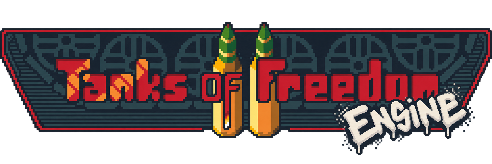

# ToF Engine



ToF Engine is a fork of Tanks of Freedom II focused on updating and optimizing
the codebase while turning game-specific behavior into a configurable engine.
Tanks of Freedom II remains the bundled reference game and compatibility
target.

The longer-term goal is to support the original Tanks of Freedom II content,
explore compatibility with [Tanks of Freedom](https://github.com/w84death/Tanks-of-Freedom),
and make the engine moddable enough to recreate other Advance Wars–style games
or build new ones.


## Project direction

- Preserve Tanks of Freedom II as the working reference game.
- Modernize and optimize the Godot codebase without changing game behavior.
- Move reusable definitions and rules into configurable resources.
- Separate static content from per-match runtime state.
- Support custom campaigns, maps, units, abilities, terrain, and rulesets.
- Investigate Tanks of Freedom 1 compatibility where its formats and mechanics
  can be mapped cleanly.

## Original game

- [Tanks of Freedom II on itch.io](https://czlowiekimadlo.itch.io/tanks-of-freedom-ii)
- [Development blog](https://czlowiekimadlo.pl/blog)
- [P1X website](https://p1x.in)
- [Original Tanks of Freedom](https://w84death.itch.io/tanks-of-freedom)

## Run from source

The project requires [Godot 4.7](https://godotengine.org/download/).

1. Clone or download this repository.
2. Import `project.godot` in Godot.
3. Run the project from the editor.

To check that the project loads without opening the editor:

```sh
: "${GODOT_BIN:=godot}"
HOME=/private/tmp "$GODOT_BIN" --headless --path "$PWD" --quit
```

Set `GODOT_BIN` to your Godot executable if it is not available as `godot` on
`PATH`.

## Tests

The repository includes the GUT test framework and unit/headless gameplay
tests. Run the full suite with:

```sh
./tools/run_gut.sh
```

The script accepts `GODOT_BIN` in the same way as the load check.

## Documentation

- [Development guide](docs/DEVELOPMENT.md) — architecture, project layout, and contribution checks
- [Map editor manual](docs/MANUAL.md) — advanced map, trigger, and story editing
- [Game design document](docs/DESIGN.md) — original ToF II world, campaign, and mechanics design
- [Changelog](docs/CHANGELOG.md) — bundled ToF II release history
- [Credits](docs/CREDITS.md) and [license](LICENSE.md)

Godot's [exporting documentation](https://docs.godotengine.org/en/stable/getting_started/workflow/export/exporting_projects.html)
explains how to build platform-specific releases.

## License

The source code and most original assets are released under the MIT License.
Third-party fonts, music, sound effects, and reference material have their own
terms. See [LICENSE.md](LICENSE.md) and [docs/CREDITS.md](docs/CREDITS.md) for
details.
